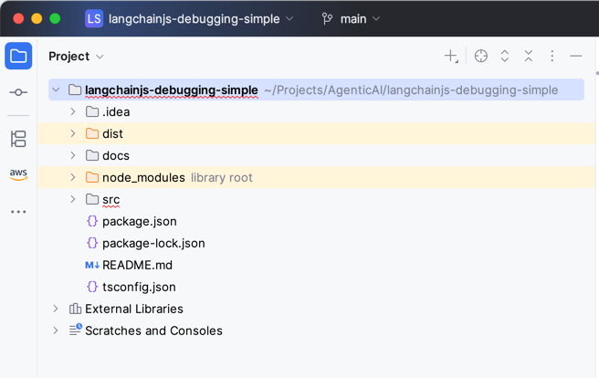
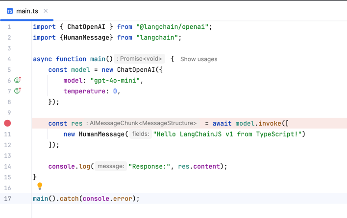
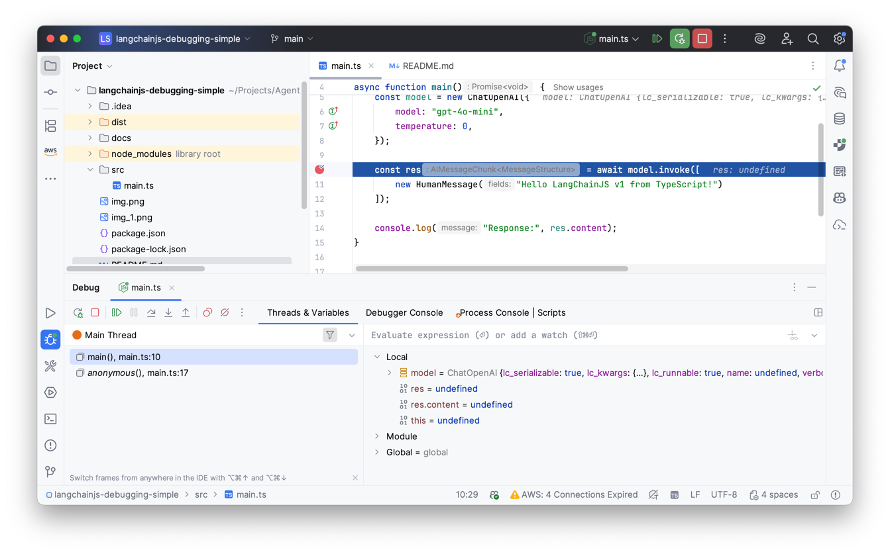
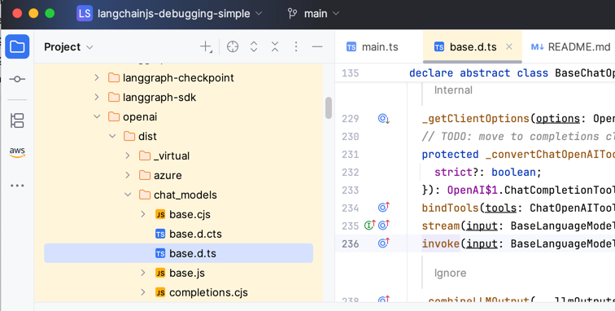
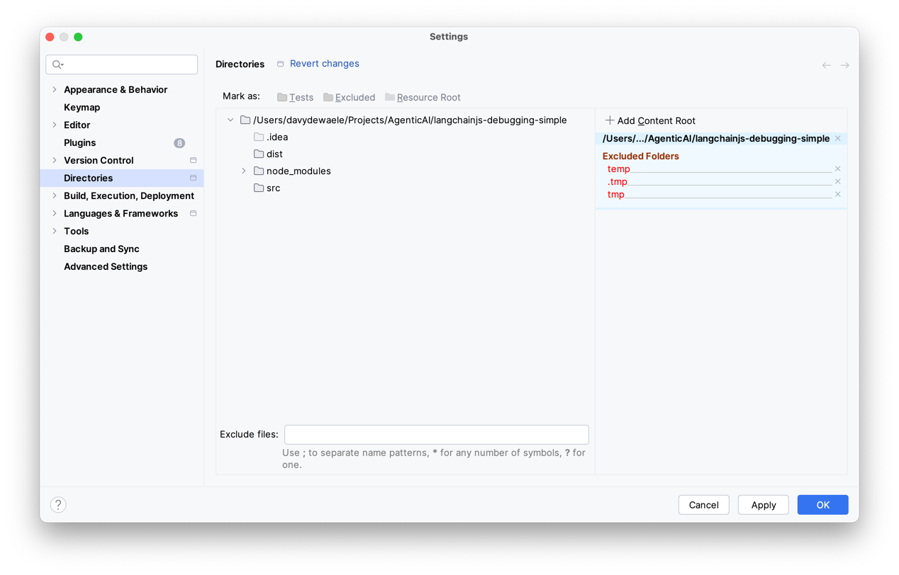
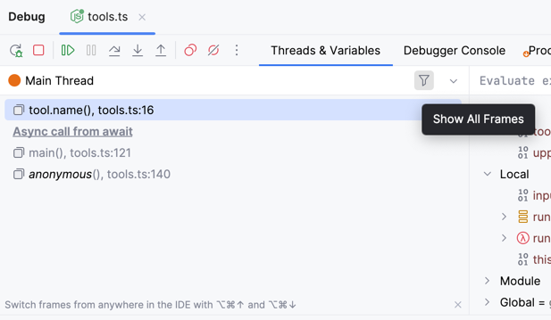
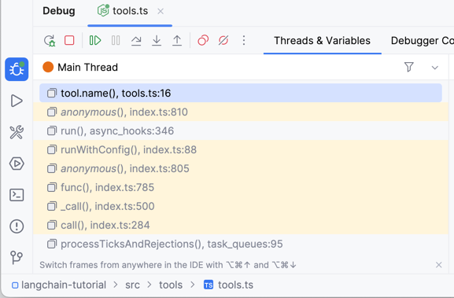

# Introduction

Goal of this repository is to show how to setup your system for debugging the LangChainJS library
while developing your own LangChainJS based project.

## Setting up the project

We're going to be setting up the project with just 3 files

- package.json
- tsconfig.json
- src/main.ts

### package.json

We start with a basic package.json file with the following dependencies

- tsx
  - TypeScript Execute (tsx): The easiest way to run TypeScript in Node.js
- @types/node
  - type definitions for all Node.js built-in APIs. (process, fs, path, ....)
- langchain: 
  - LangChain is a framework for building AI tools
- @langchain/openai: 
  - OpenAI integration for LangChain

We also have some scripts to run / develop and build the project.

```
{
  "name": "langchainjs-project",
  "version": "0.0.1",
  "type": "module",
  "main": "dist/main.js",
  "scripts": {
    "start": "tsx src/main.ts",
    "dev": "tsx watch src/main.ts",
    "build": "tsc -p tsconfig.json"
  },
  "dependencies": {
    "@langchain/openai": "^1.1.3",
    "langchain": "^1.1.1"
  },
  "devDependencies": {
    "@types/node": "^24.10.1",
    "tsx": "^4.20.6"
  }
}


```

### tsconfig.json

Here's a modern version of the tsconfig.json file : 

```
{
  "compilerOptions": {
    "target": "ES2022",
    "lib": ["ES2022", "DOM"],
    "module": "NodeNext",
    "moduleResolution": "NodeNext",
    "moduleDetection": "force",
    "strict": true,
    "esModuleInterop": true,
    "skipLibCheck": true,
    "resolveJsonModule": true,
    "rootDir": "src",
    "outDir": "dist",
    "types": ["node"]
  },
  "include": ["src"]
}
```

### src/main.ts

And the star of the show, the main application that we will run in our typescript source file.

```
import { ChatOpenAI } from "@langchain/openai";
import {HumanMessage} from "langchain";

async function main() {
    // your OPENAI_API_KEY must exist in env
    const model = new ChatOpenAI({
        model: "gpt-4o-mini",
        temperature: 0,
    });

    const res = await model.invoke([
        new HumanMessage("Hello LangChainJS v1 from TypeScript!")
    ]);

    console.log("Response:", res.content);
}

main().catch(console.error);
```

### Project structure

You'll see the following structure in your project folder 



### Debugging in WebStorm

We'll start by adding a breakpoint in our app



Our breakpoint will be hit



When debugging you'll notice that we'll often hit the typescript definition files instead of the actual source files.




## Debugging

In order to debug the project, we are going to have to 

- clone the langchainjs sources somewhere on your filesystem
- link the sources to the global node_modules folder
- link the sources to your project folder
- add the sources in your IDE

If you don't do this you will get stacks like this that you cannot navigate.
Upon closer inspection, you'll notice that the source files mentioned in this stack do not exist.

```
TypeError: Cannot read properties of null (reading 'toChatMessages')
    at <anonymous> (/Users/davydewaele/Projects/AgenticAI/langchainjs-debugging/node_modules/@langchain/core/src/language_models/chat_models.ts:852:19)
    at Array.map (<anonymous>)
    at ChatOpenAI.generatePrompt (/Users/davydewaele/Projects/AgenticAI/langchainjs-debugging/node_modules/@langchain/core/src/language_models/chat_models.ts:851:58)
    at ChatOpenAI.invoke (/Users/davydewaele/Projects/AgenticAI/langchainjs-debugging/node_modules/@langchain/core/src/language_models/chat_models.ts:278:31)
    at ChatOpenAI.invoke (/Users/davydewaele/Projects/AgenticAI/langchainjs-debugging/node_modules/@langchain/openai/src/chat_models/base.ts:637:18)
    at main (/Users/davydewaele/Projects/AgenticAI/langchainjs-debugging/src/main.ts:10:29)
    at <anonymous> (/Users/davydewaele/Projects/AgenticAI/langchainjs-debugging/src/main.ts:15:1)
    at ModuleJob.run (node:internal/modules/esm/module_job:262:25)
    at async onImport.tracePromise.__proto__ (node:internal/modules/esm/loader:482:26)
    at async asyncRunEntryPointWithESMLoader (node:internal/modules/run_main:117:5)
```

What you want is this. 

```
TypeError: Cannot read properties of null (reading 'toChatMessages')
    at <anonymous> (/Users/davydewaele/Projects/AgenticAI/langchainjs/libs/langchain-core/src/language_models/chat_models.ts:852:19)
    at Array.map (<anonymous>)
    at ChatOpenAI.generatePrompt (/Users/davydewaele/Projects/AgenticAI/langchainjs/libs/langchain-core/src/language_models/chat_models.ts:851:58)
    at ChatOpenAI.invoke (/Users/davydewaele/Projects/AgenticAI/langchainjs/libs/langchain-core/src/language_models/chat_models.ts:278:31)
    at ChatOpenAI.invoke (/Users/davydewaele/Projects/AgenticAI/langchainjs-debugging/node_modules/@langchain/openai/src/chat_models/base.ts:637:18)
    at main (/Users/davydewaele/Projects/AgenticAI/langchainjs-debugging/src/main.ts:10:29)
    at <anonymous> (/Users/davydewaele/Projects/AgenticAI/langchainjs-debugging/src/main.ts:15:1)
    at ModuleJob.run (node:internal/modules/esm/module_job:262:25)
    at async onImport.tracePromise.__proto__ (node:internal/modules/esm/loader:482:26)
    at async asyncRunEntryPointWithESMLoader (node:internal/modules/run_main:117:5)
```

Links that work to actual source code on your filesystem. A subtle difference is that the sources are not installed in your node_modules folder, but they are pointing
to the actual source files on your filesystem.


So how do we do that ?

Lets go over all these steps : 

### Clone the sources

Clone the sources from the langchainjs repository :

```
git clone https://github.com/langchain-ai/langchainjs
```

Just make sure they are somewhere on your filesystem. They don't need to be in the same folder as your project.

In the sources folder we will need to execute the following commands :

- `pnpm build` to build the project
- `pnpm link --global` to link the project globally


### Global linking

Global linking creates a global symlink to a local package so other projects can consume it as if it were installed, while still editing the source locally.
If we apply this to the LangChainJS sources, instead of installing LangChainJS from npmjs, we can now have it point to a locally checkout source folder of LangChainJS.

This has may advantages

- pointing to the actual source code
- allows you to make changes to the source code.

In the sources folder you can use the following commands : 

- `pnpm build` : to build the entire project
- `pnpm link --global` Global linking the sources
- `pnpm unlink --global` Unlink the project globally

if you have a more complex project like langchainjs containing several modules, you will need to link each module individually.

For example, langchainjs contains the following modules :

- langchain
- @langchain/core
- @langchain/openai

These are located in the langchainjs/packages folder

- langchainjs/langchain
- langchainjs/langchain-core
- langchainjs/libs/langchain-openai

In order to link the @langchain/core module, you will need to run the following commands : 

```
pnpm link --global langchain
pnpm link --global @langchain/core
pnpm link --global @langchain/openai
```


## Link the sources to your project folder

Next thing we need to do is link the sources to our project folder.

```
pnpm link --global @langchain/core
```

This will create a symlink in your global node_modules folder.
So instead of pointing to a download of an npmjs package, we will now point to a symlink to the sources.

However, this is not sufficient. As there source files are not visible to your IDE we will need to link them.

This is done by adding the sources in your WebStorm IDE.
Click `Command` + `,` and go to the Directories section and add a content root



## Notes

### pnpm unlink vs pnpm remove

You can look at the modules that are linked globally with the following command :
```
ls -ltr ~/Library/pnpm/global/5/node_modules
total 0
lrwxr-xr-x  1 davydewaele  staff   59 Nov 30 16:37 langchain -> ../../../../../../../private/tmp/langchainjs/libs/langchain
drwxr-xr-x  4 davydewaele  staff  128 Dec  5 08:47 @langchain
```

or 

```
ls -ltr ~/Library/pnpm/global/5/node_modules/@langchain/
total 0
lrwxr-xr-x  1 davydewaele  staff  80 Dec  2 16:59 openai -> ../../../../../../Projects/AgenticAI/langchainjs/libs/providers/langchain-openai
lrwxr-xr-x  1 davydewaele  staff  68 Dec  5 08:47 core -> ../../../../../../Projects/AgenticAI/langchainjs/libs/langchain-core
```

this means that there are 3 modules linked globally :

- langchain
- @langchain/core
- @langchain/openai

If you want to remove a module,

```
pnpm remove langchain -g
pnpm remove @langchain/core -g
pnpm remove @langchain/openai -g
```

Verify everything is removed

```
base ❯ ls -l ~/Library/pnpm/global/5/node_modules/
total 0
```


### View all frames

View all frames



View all frames


